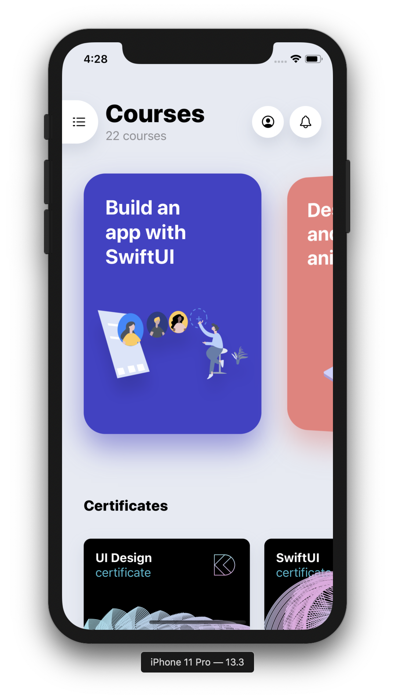
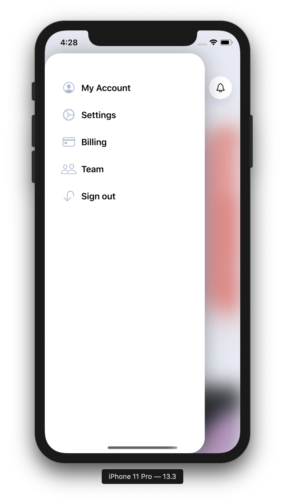
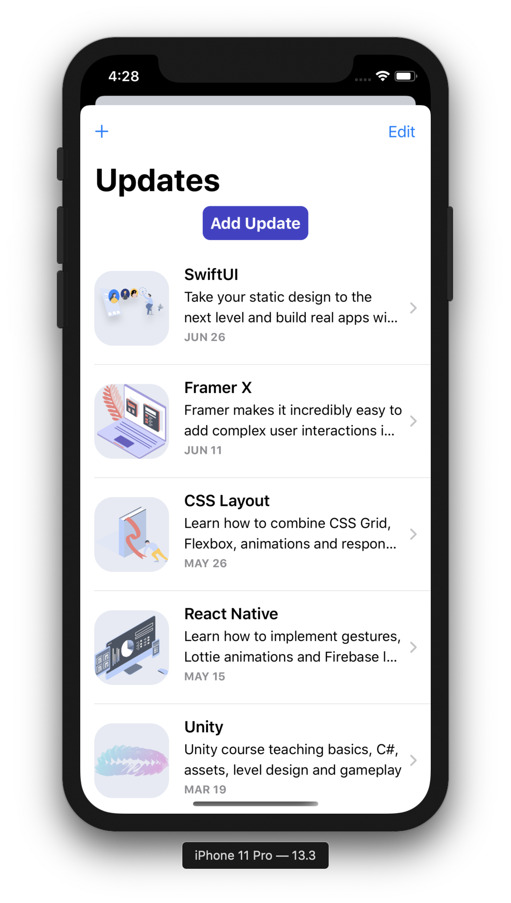
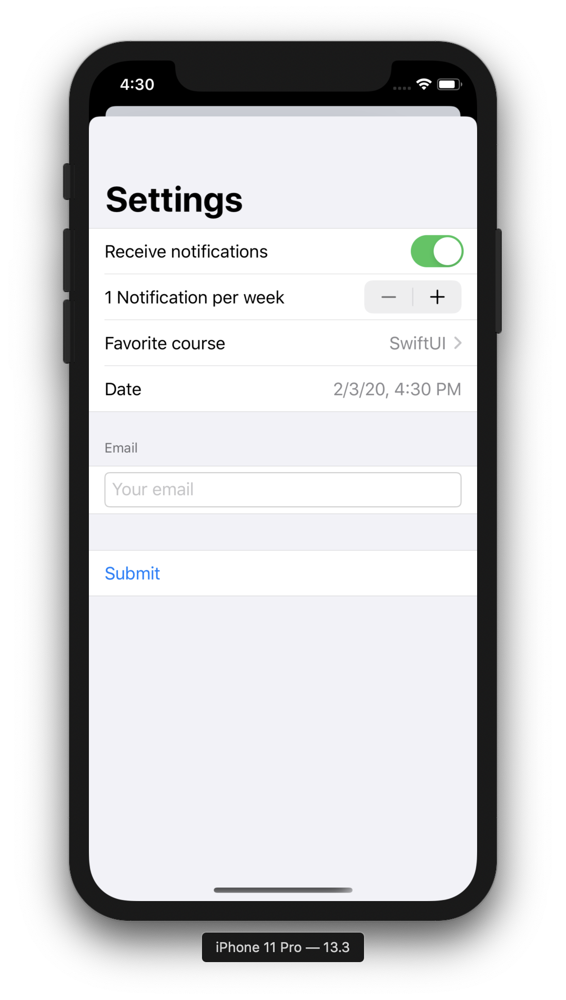
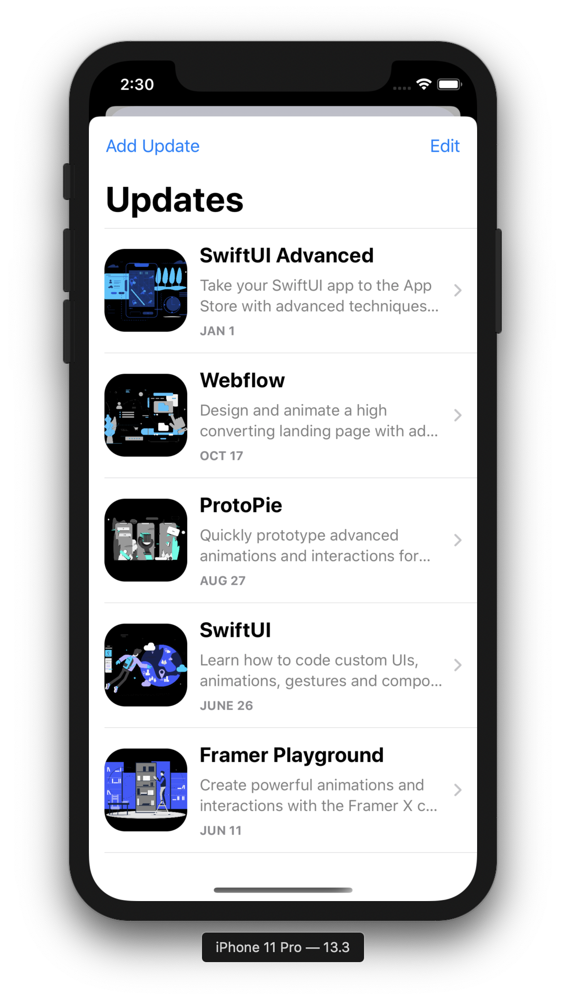

# SwiftUI-from-scratch

Let's start with SwiftUI~

## Resources

- [Learn to Make Apps with SwiftUI - Apple](https://developer.apple.com/tutorials/swiftui/tutorials)
- [SwiftUI 与 Combine 编程 - 王巍 @onevcat](https://objccn.io/products/swift-ui)
- [SwiftUI by Tutorials - raywenderlich.com](https://store.raywenderlich.com/products/swiftui-by-tutorials)
- [Combine: Asynchronous Programming with Swift - raywenderlich.com](https://store.raywenderlich.com/products/combine-asynchronous-programming-with-swift)
- [100 Days of SwiftUI - Hacking with Swift](https://www.hackingwithswift.com/100/swiftui)
- [Build an app with SwiftUI - Design + Code](https://designcode.io/swiftui?promo=learnswiftui)
- [Learn SwiftUI for iOS 13 - Design + Code](https://designcode.io/swiftui2)

## Demos

### Apple

#### SwiftUI Essentials

<table style="border: 0;">
  <tr>
  <td style="border: 0;">
    
  </td>
  <td style="border: 0;">
	
  </td>
  <td style="border: 0;">
	
  </td>
  </tr>
</table>

#### Drawing and Animation

<table style="border: 0;">
  <tr>
  <td style="border: 0;">
    
  </td>
  <td style="border: 0;">
    
  </td>
  </tr>
</table>

#### App Design and Layout

<table style="border: 0;">
  <tr>
  <td style="border: 0;">
    
  </td>
  <td style="border: 0;">
    
  </td>
  </tr>
</table>

#### Framework Integration

<table style="border: 0;">
  <tr>
  <td style="border: 0;">
    
  </td>
  <td style="border: 0;">
    
  </td>
  <td style="border: 0;">
    
  </td>
  <td style="border: 0;">
    
  </td>
  </tr>
</table>

### objccn

### Design + Code

#### Build an app with SwiftUI

<table style="border: 0;">
  <tr>
  <td style="border: 0;">
    
  </td>
  <td style="border: 0;">
    
  </td>
  <td style="border: 0;">
    
  </td>
  <td style="border: 0;">
    
  </td>
  </tr>
</table>

#### Learn SwiftUI for iOS 13

<table style="border: 0;">
  <tr>
  <td style="border: 0;">
    
  </td>
  <td style="border: 0;">
    
  </td>
  <td style="border: 0;">
    
  </td>
  <td style="border: 0;">
    
  </td>
  </tr>
</table>